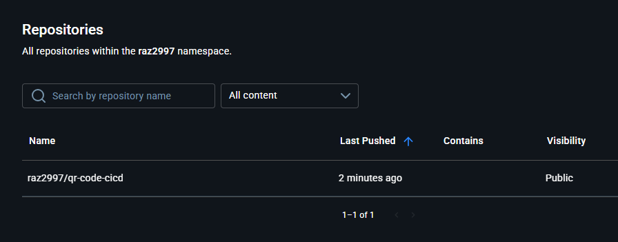

# Devops - Automated Builds Pushing to DockerHub Intro

For this assignment, I built upon the QR code project to create a GitHub repository with a CI/CD workflow using GitHub Actions. The workflow automatically tests, builds, and pushes a Docker image to DockerHub. The project generates a QR code linking to my GitHub profile.

## Instructor Videos:
1. [Important Docker Commands to Know](https://youtu.be/B26ecGh8tMw)
2. [Automated Builds Complete Demo](https://youtu.be/PZVT1IOC0Zo)
I improved the workflow from the video by separating the jobs into `test` and `build-and-push`, using `needs` to ensure the test job completes first.

## Screenshots

1. Screenshot of my image in my DockerHub account:
   